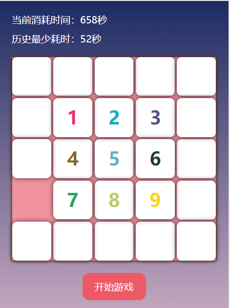

# Demo

### 我写了一本前端进阶小书，推荐给大家[github 地址](https://github.com/zxpsuper/advanced_front_end)

### **个人小项目展示及源码小仓库。**

20. **轮播图**

-   [源码](https://github.com/zxpsuper/Demo/blob/master/carousal/carousal.html)+[Demo](https://zxpsuper.github.io/Demo/carousal/carousal.html)

---

19. **小皮咖图像滤镜**

-   [Canvas 进阶（五）实现图片滤镜效果](https://juejin.im/post/5dfb15b96fb9a016164362b2)
-   [源码](https://github.com/zxpsuper/Demo/blob/master/suporka_image_filter/index.html)+[Demo](https://zxpsuper.github.io/Demo/suporka_image_filter/)

---

18. **拼图小游戏**

-   拼图小游戏（将 1-9 按顺序排在中间位置即可）
-   [源码](https://github.com/zxpsuper/Demo/blob/master/numbergame/index.js)+[Demo](https://zxpsuper.github.io/Demo/numbergame/)

---

17. **实现一个“刮刮乐”游戏**

-   [Canvas 进阶（四）实现一个“刮刮乐”游戏](https://juejin.im/post/5d664786f265da03ee6a694f)
-   [源码](https://github.com/zxpsuper/Demo/blob/master/letter/scrapAward-dev.js)+[Demo](https://zxpsuper.github.io/Demo/letter/)

---

16. **Typescript 手写辨色小游戏**

-   [Canvas 进阶（三）ts + canvas 重写”辨色“小游戏](https://juejin.im/post/5d22af2b6fb9a07ea7133361)
-   [源码](https://github.com/zxpsuper/Demo/tree/master/color)+[Demo](https://zxpsuper.github.io/Demo/color/colorTs.html)

---

15. **写一个生成带 logo 的二维码 npm 插件**

-   [Canvas 进阶（二）写一个生成带 logo 的二维码 npm 插件](https://juejin.im/post/5d1c461f6fb9a07f070e4768)
-   [源码](https://github.com/zxpsuper/qrcode-with-logos)+[Demo](https://zxpsuper.github.io/qrcode-with-logos/dist/)

---

14. **二维码的扫码识别**

-   [Canvas 进阶（一）二维码的生成与扫码识别](https://juejin.im/post/5d00b3626fb9a07ed74076a9)
-   [源码](https://github.com/zxpsuper/Demo/tree/master/qrcode)+[Demo](https://zxpsuper.github.io/Demo/qrcode/qrcode-scan.html)

---

13. **二维码的生成**

-   [Canvas 进阶（一）二维码的生成与扫码识别](https://juejin.im/post/5d00b3626fb9a07ed74076a9)
-   [源码](https://github.com/zxpsuper/Demo/blob/master/qrcode/index.html)+[Demo](https://zxpsuper.github.io/Demo/qrcode/)

---

12. **小皮咖导航**

-   [源码](https://github.com/zxpsuper/Demo/tree/master/navigation)+[Demo](https://zxpsuper.github.io/Demo/navigation/)

---

11. **情人节撸一个表白页面**

-   [相关文章——情人节撸一个表白页面](https://juejin.im/post/5c6521b8f265da2dcd79ca74)

-   [源码](https://github.com/zxpsuper/Demo/tree/master/valentine_day)+[Demo](https://zxpsuper.github.io/Demo/valentine_day/name.html)

---

10. **一款轮播组件的诞生**

-   [相关文章——一款轮播组件的诞生](https://juejin.im/post/5c24925fe51d4502a232fb6b)

-   [源码](https://github.com/zxpsuper/suporka-carousal)+[Demo](https://zxpsuper.github.io/Demo/carousal/index.html)

---

9. **ES6 手写一个“辨色”小游戏**

-   [相关文章——ES6 手写一个“辨色”小游戏](https://segmentfault.com/a/1190000016444812)

-   [源码](./color/index.js)+[Demo](https://zxpsuper.github.io/Demo/color/index.html)

---

8. **VUE 时间选择器**

-   [相关文章——vue 手写一个时间选择器](https://juejin.im/post/5b62b0cfe51d453489494efb)

-   [源码](./datepicker/Datepicker.vue)+[Demo](https://zxpsuper.github.io/Demo/datepicker/index.html)

---

7. **CANVAS 刮奖小 Demo**

-   [相关文章——canvas 实现刮刮乐](https://blog.csdn.net/weixin_38788347/article/details/78239704)

-   [源码](./guajiang/index.html)+[Demo](https://zxpsuper.github.io/Demo/guajiang/index.html)

---

6. **瀑布流的实现**

-   [相关文章——瀑布流布局的实现](https://blog.csdn.net/weixin_38788347/article/details/78390064)

-   CSS 实现瀑布流——[源码](./waterflow/waterfallcss.html)+[Demo](https://zxpsuper.github.io/Demo/waterflow/waterfallcss.html)

-   JAVASCRIPT 实现瀑布流——[源码](./waterflow/waterfalljs.html)+[Demo](https://zxpsuper.github.io/Demo/waterflow/waterfalljs.html)

-   JQUERY 实现瀑布流——[源码](./waterflow/waterfalljq.html)+[Demo](https://zxpsuper.github.io/Demo/waterflow/waterfalljq.html)

---

5. **websocket**

-   [相关文章——使用 socket.io.js 实现 websocket 实时通讯](https://blog.csdn.net/weixin_38788347/article/details/79726992)

-   [源码](./websocket/)

---

4. **图片懒加载**

-   [相关文章——懒加载](https://blog.csdn.net/weixin_38788347/article/details/78217372)

-   [源码](./lazyload.html)+[Demo](https://zxpsuper.github.io/Demo/lazyload.html)

---

3. **拖曳效果**

-   [相关文章——利用 JQ 实现简单的拖曳效果](https://blog.csdn.net/weixin_38788347/article/details/78273565)

-   [源码](./drag.html)+[Demo](https://zxpsuper.github.io/Demo/drag.html)

---

2. **Quill 富文本编辑器**

-   [相关文章——quill——简单的富文本编辑器](https://blog.csdn.net/weixin_38788347/article/details/78249433)

-   [源码](./quill.html)+[Demo](https://zxpsuper.github.io/Demo/quill.html)

---

1. **CANVAS 页面时钟**

-   [相关文章](https://blog.csdn.net/weixin_38788347/article/details/78239704)

-   [源码](./watch.html)+[Demo](https://zxpsuper.github.io/Demo/watch.html)
