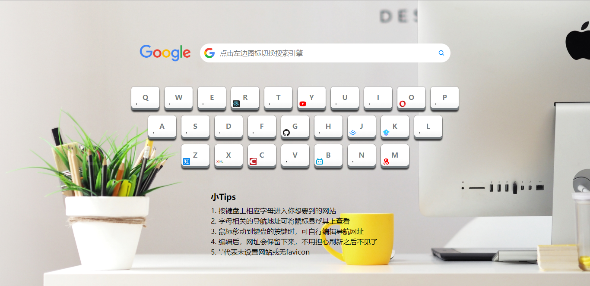
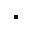

# 小清新导航

## 前言

本文主要介绍：

1. 项目介绍（简介，功能，使用到的技术栈）
2. 项目效果展示
3. 一步步实现项目效果
4. 踩坑

## 一、项目介绍

**名称：**优美快捷的小清新导航

**技术栈：**HTML5，CSS3，JavaScript

**功能描述：**

- 一个优美快捷的个人导航页，附加主流搜索引擎**搜索**功能
- 为键盘上的 26 个字母绑定了导航网址，敲击键盘上的字母可跳转相应网页
- 自定义与字母关联的导航地址，数据存在本地LocalStorage中
- 基于原生 JS，键盘按键动态生成，按键样式完全使用CSS3完成

## 二、项目效果展示

[项目地址](https://github.com/xyyojl/myBookmarks) [预览地址](https://xyyojl.github.io/myBookmarks/index.html)

### 预览图



看完上面的预览图，是不是有一点兴奋，想自己敲出一个属于自己的小清新导航。下面就开始动手敲代码吧！

## 三、一步步实现项目效果

###  （一）分析页面

做一个网站之前，要搞清楚这个网站是什么？写一写，画一画，可以使用**用例图**，画一个人，想想那个人可以有什么操作？用户进入我们网站有哪些功能？

用户可以进行的操作：

- 搜索
  - 百度搜索
  - google搜索「前提是你懂得」
- 敲击键盘上的字母，打开新页面
- 自定义与字母关联的导航地址

### （二）选择数据结构

- q对应着`qq.com`「哈希」
- 把键盘的结构的存储下来「数组」

### （三）进行HTML布局

先直接使用html打好框架：

```html
<!DOCTYPE html>
<html lang="zh-Hans">
<head>
    <meta charset="UTF-8">
    <meta name="viewport" content="width=device-width, initial-scale=1.0">
    <meta http-equiv="X-UA-Compatible" content="ie=edge">
    <title>小清新导航</title>
    <link rel="stylesheet" href="./css/normalize.css">
    <link rel="stylesheet" href="./css/style.css">
</head>
<body>
    <header>
        <ul>
            <li>
                <a href=""></a>
            </li>
            <li>
                <a href=""></a>
            </li>
        </ul>
        <form action="">
            <ul>
                <li>
                    
                </li>
                <li>
                    
                </li>
            </ul>
            <input type="text">
            <button></button>
        </form>
    </header>
    <main>
        <div id="main" class="wrapper">
            <div class="row">
                <div class="kbd_wrapper">
                    <kbd>
                        <span>q</span>
                        
                        <button></button>
                    </kbd>
                </div>
            </div>
        </div>
    </main>
    <footer>
        <h3>小Tips</h3>
        <ul>
            <li>1. 按键盘上相应字母进入你想要到的网站</li>
            <li>2. 字母相关的导航地址可将鼠标悬浮其上查看</li>
            <li>3. 鼠标移动到键盘的按键时，可自行编辑导航网址</li>
            <li>4. 编辑后，网址会保留下来，不用担心刷新之后不见了</li>
            <li>5. '.'代表未设置网站或无favicon</li>
        </ul>
    </footer>	
    <script src="./js/main.js"></script>
</body>
</html>
```

给HTML标签添加class，并添加图片。注：仅仅是个人习惯！

```html
<header>
    <ul id="searchEnginPic" class="searchEnginPic">
        <li class="active">
            <a href="https://www.google.com.hk/" target="_blank"></a>
        </li>
        <li>
            <a href="https://www.baidu.com/" target="_blank"></a>
        </li>
    </ul>
    <form action="" id="searchBar" class="searchBar">
        <ul id="searchEnginLogo" class="searchEnginLogo">
            <li class="active">
                
            </li>
            <li>
                
            </li>
        </ul>
        <input type="text" id="inputBar">
        <button id="searchBtn" class="searchBtn"></button>
    </form>
</header>
<main>
    <div id="main" class="wrapper">
        <div class="row">
            <div class="kbd_wrapper">
                <kbd class="key">
                    <span>q</span>
                    
                    <button>e</button>
                </kbd>
            </div>
        </div>
    </div>
</main>
<footer class="description">
    <h3>小Tips</h3>
    <ul class="tips-content">
        <li>1. 按键盘上相应字母进入你想要到的网站</li>
        <li>2. 字母相关的导航地址可将鼠标悬浮其上查看</li>
        <li>3. 鼠标移动到键盘的按键时，可自行编辑导航网址</li>
        <li>4. 编辑后，网址会保留下来，不用担心刷新之后不见了</li>
        <li>5. '.'代表未设置网站或无favicon</li>
    </ul>
</footer>
```

### （四）用CSS美化界面

#### 1.美化头部搜索

```css
*{margin: 0;padding:0;}
ul{list-style: none;}
.clearfix::after{
    content: '';
    display: block;
    clear: both;
}

/* 注意：这里图片路径是相对路径 */
body{
    background: #ccc url(../image/bg.jpg) no-repeat center center;
    background-size: cover;
}

/* header */
header{
    width: 720px;
    height: 44px;
    margin: 100px auto 50px;
}
header .searchEnginPic{
    float: left;
    width: 120px;
    height: 44px;
}
header .searchEnginPic li{
    display: none;
}
header .searchEnginPic li.active{
    display: inline-block;
}
header .searchEnginPic li:nth-child(1) img{
    width: 120px; 
    padding: 2.5px 0;
}
header .searchEnginPic li:nth-child(2) img{
    width: 120px; 
    height: 44px;
}

header .searchBar{
    float: right;
    width: 580px;
    height: 44px;
    border-radius: 24px;
    position: relative;
    background: #fff;
}
header .searchBar:hover{
    box-shadow: 0 1px 6px 0 rgba(32,33,36,0.28);
    border-color: rgba(223,225,229,0);
}
header .searchBar .searchEnginLogo{
    position: absolute;
    left: 10px;
    width: 24px;
    height: 44px;
    cursor: pointer;
}
header .searchBar .searchEnginLogo li{
    display: none;
}
header .searchBar .searchEnginLogo li.active{
    display: inline-block;
}
.searchBar .searchEnginLogo li img{
    width: 24px;
    height: 24px;
    padding: 10px 0;
}
.searchBar input{
    position: absolute;
    left: 46px;
    top: 10%;
    width: 505px;
    height: 80%;
    border: none;
    outline: none;
}
.searchBar .searchBtn{
    position: absolute;
    right: 6px;
    top: 7px;
    width: 30px;
    height: 30px;
    background: url(../image/search-btn.png) center center no-repeat;
    cursor: pointer;
    border: none;
    outline: none;
}
```
#### 2.给键盘的按键添加样式

```css
/* main */
.wrapper div{
    width: 850px;
    margin: 0 auto;
    text-align: center;
}
.wrapper .kbd_wrapper{
    display: inline-block;
    vertical-align: top;
    width: 65px;
    height: 55px;
    border-radius: 7px;
    margin: 6px;
    box-shadow: 0 4px 3px 0 #3C3C3D, 0 0 1px 0 #3C3C3D;
    text-align: center;
}
.wrapper kbd{
    position: relative;
    display: inline-block;
    width: 65px;
    height: 50px;
    background: linear-gradient(to bottom, #fff 0%,#fff 70%,#f3f3f3 100%);
    border-radius: 7px;
    box-shadow: 0 5px 0 0 #767d81;
    color: #767D81;
    font-family: Helvetical;
    vertical-align: top;
    line-height: 50px;
    text-transform: uppercase;
    font-weight: bold;
    transition: all .2s linear;
}
.wrapper .kbd_wrapper:hover {
    cursor: pointer;
    animation: shake 0.82s cubic-bezier(.36, .07, .19, .97) both;
    transform: translate3d(0, 0, 0);
    backface-visibility: hidden;
    perspective: 1000px;
}
.wrapper kbd > button{
    display: none;
    position: absolute;
    right: 2px;
    bottom: 2px;
    font-size: 12px;
    width: 16px;
    height: 16px;
    border-radius: 5px;
    border: none;
    outline: none;
    color: #333;
    cursor: pointer;
}
.wrapper kbd:hover > button{
    display: inline-block;
}
.wrapper kbd > button:hover{
    background: #806605;
    color: #fff;
}
.key img{
    width: 16px;
    height: 16px;
    position: absolute;
    left: 4px;
    bottom: 2px;
}
@keyframes shake {
    10%, 90% {
        transform: translate3d(-1px, 0, 0);
    }
    20%, 80% {
        transform: translate3d(2px, 0, 0);
    }
    30%, 50%, 70% {
        transform: translate3d(-4px, 0, 0);
    }
    40%, 60% {
        transform: translate3d(4px, 0, 0);
    }
}
```

#### 3.美化底部tips

```css
/* footer */
footer{
    width: 390px;
    margin: 50px auto 0;
}
footer h3{
    margin-bottom: 10px;
}
footer .tips-content li{
    padding: 3px 0;
}
```

### （五）使用JS创建HTML，添加事件实现效果

#### 1. 初始化数据 

初始化数据的时候，需要获取localStorage里面的data对应的hash  

```js
//1.初始化数据
let hashA = init();
let keys = hashA['keys'];
let hash = hashA['hash'];

// 下面是工具函数
function init(){
    let keys = {
        0 : ['q','w','e','r','t','y','u','i','o','p'],
        1 : ['a','s','d','f','g','h','j','k','l'],
        2 : ['z','x','c','v','b','n','m'],
        length : 3
    }
    let hash = {
        q : 'qq.com',
        w : 'wangdoc.com',
        e : undefined,
        r : 'react-juejin.foreversnsd.cn',
        t : 'tgideas.qq.com/doc/',
        y : 'youtube.com',
        i : 'iciba.com',
        o : undefined,
        p : undefined,
        a : undefined,
        s : 'segmentfault.com',
        d : 'dribbble.com',
        f : undefined,
        g : 'github.com',
        h : undefined,
        j : 'juejin.im',
        k : 'ke.qq.com',
        l : undefined,
        z : 'zhihu.com',
        x : 'xiedaimala.com',
        c : 'csdn.net',
        v : undefined,
        b : 'bilibili.com',
        n : undefined,
        m : 'mail.163.com'
    }
    let hasInLocalStorage = getFormLocalStorage('data');
    if(hasInLocalStorage){
        hash = hasInLocalStorage;
    }
    return {'keys':keys,'hash':hash}
}

function getFormLocalStorage(name){
    return JSON.parse(localStorage.getItem(name) || 'null')
}
```

#### 2. 生成键盘 

记得要把class为wrapper的div的内容删掉，用js生成html 

```js
//2.生成键盘
generateKeyBoard(keys,hash);

function generateKeyBoard(keys, hash) {
    for (let index = 0; index < keys['length']; index = index + 1) { //0 1 2
        let div = tag('div');
        main.appendChild(div);

        let row = keys[index];
        for (let index2 = 0; index2 < row['length']; index2 = index2 + 1) { //将固定的10换成可控制的
            let kbd_wrapper = tag('div');
            kbd_wrapper.className = 'kbd_wrapper';
            let kbd = tag('kbd');
            kbd.className = 'key';
            let span = createSpan(row[index2]);
            let img = createImage(hash[row[index2]]);
            let button = createButton(row[index2]);
        
            // 判断按键是否已经有对应的网址
            if (hash[row[index2]] === undefined) {
                kbd.setAttribute('title', '未设置网站导航');
            } else {
                kbd.setAttribute('title', hash[row[index2]]);
            }

            kbd.onclick = function (e) {
                let website = e.currentTarget.getAttribute('title');
                if (website === '未设置网站导航') {
                    alert('请编辑此按键的网站再跳转');
                } else {
                    window.open('http://' + website, "_blank");
                }
            }
            
            kbd.appendChild(span);
            kbd.appendChild(img);
            kbd.appendChild(button);
            kbd_wrapper.appendChild(kbd);
            div.appendChild(kbd_wrapper);
        }
    }
}

function tag(tagName) {
    let element = document.createElement(tagName);
    return element;
}

function createSpan(textContent) {
    let span = tag('span');
    span.textContent = textContent; //第一个数组 第二个数组 第三个数组
    span.className = 'text';
    return span;
}

function createButton(id) {
    let button = tag('button');
    button.textContent = 'e';
    button.id = id;
    button.onclick = function (e) {
        //阻止事件冒泡
        e.stopPropagation();
        let button2 = e['target'];
        let img2 = button2.previousSibling;
        //获取当前的id
        let key = button2['id'];
        //用户输入一个网址
        let web = prompt('请输入一个网址：');
        //将原来的hash给替换掉
        hash[key] = web;
        img2.src = 'http://' + web + '/favicon.ico';
        console.log(e.target)
        img2.onerror = function (e) {
            e.target.src = './image/dot.png';
        }
        localStorage.setItem('data', JSON.stringify(hash));
    }
    return button;
}

function createImage(domain) { //hash[row[index2]]
    let img = tag('img');
    if (domain) {
        img.src = 'http://' + domain + '/favicon.ico';
    } else {
        img.src = './image/dot.png';
    }
    img.onerror = function (e) {
        e.target.src = './image/dot.png';
    }
    return img;
}
```

#### 3.监听用户动作  

```js
//3.监听用户动作
listenToUser(hash);
switchSearchEngin();

function listenToUser(hash) {
    // ifInputting作为一个开关
    let ifInputting = false;
    let inputBar = document.getElementById('inputBar');
    let searchBtn = document.querySelector('.searchBtn');
    inputBar.addEventListener('focus', function (e) {
        ifInputting = true;
        e.target.placeholder = '';
    })
    inputBar.addEventListener('focusout', function (e) {
        ifInputting = false;
        e.target.placeholder = '点击左边图标切换搜索引擎';
    })
    searchBtn.onclick = function (e) {
        e.preventDefault();
        let searchContent = inputBar.value;
        // 判断是什么搜索引擎
        let searchEnginLogo = document.getElementById('searchEnginLogo');
        let engin = searchEnginLogo.getAttribute('data-engin');
        switch (engin) {
            case 'baidu':
                window.open("https://www.baidu.com/s?wd=" + searchContent, '_blank');
                break;
            case 'google':
                window.open("https://www.google.com.hk/search?q=" + searchContent, '_blank');
                break;
        }
    }

    document.onkeypress = function (e) {
        let key = e['key'];
        let website = hash[key];
        if (!ifInputting) {
            if (website === undefined) {
                alert('请编辑此按键的网站再跳转')
            } else {
                window.open('http://' + website, "_blank");
            }
        }
    }
}

// 切换搜索引擎
function switchSearchEngin() {
    // 搜索引擎默认是google
    let ifSwitch = false;
    let searchEnginLogo = document.getElementById('searchEnginLogo');
    let googleLogo = document.querySelector('#searchEnginLogo li:nth-child(1)');
    let baiduLogo = document.querySelector('#searchEnginLogo li:nth-child(2)');
    let googlePic = document.querySelector('#searchEnginPic li:nth-child(1)');
    let baiduPic = document.querySelector('#searchEnginPic li:nth-child(2)');
    searchEnginLogo.setAttribute('data-engin', 'google');
    searchEnginLogo.onclick = function () {
        if (!ifSwitch) {
            // google --> baidu
            googleLogo.classList.remove('active');
            baiduLogo.classList.add('active');
            googlePic.classList.remove('active');
            baiduPic.classList.add('active');
            searchEnginLogo.setAttribute('data-engin', 'baidu');
        } else {
            // baidu --> google
            baiduLogo.classList.remove('active');
            googleLogo.classList.add('active');
            baiduPic.classList.remove('active');
            googlePic.classList.add('active');
            searchEnginLogo.setAttribute('data-engin', 'google');
        }
        ifSwitch = !ifSwitch;
    }
}
```

## 踩坑

### （一）问题1 搜索框输入和按键按下跳转出现冲突 

解决办法：

定义一个变量（boolean类型）作为一个开关，当input获得焦点，将那个变量变成true，当input失去焦点，将那个变量变成false。同时事件触发的时候判断这个变量，来明确用户是要输入文字搜索，还是想按下按键跳转到想去的网页。更加详细的代码，请看上面或者是github上的代码。

```js
let ifInputting = false;
let inputBar = document.getElementById('inputBar');
let searchBtn = document.querySelector('.searchBtn');
inputBar.addEventListener('focus', function (e) {
    ifInputting = true;
    e.target.placeholder = '';
})
inputBar.addEventListener('focusout', function (e) {
    ifInputting = false;
    e.target.placeholder = '点击左边图标切换搜索引擎';
})

document.onkeypress = function (e) {
    let key = e['key'];
    let website = hash[key];
    if (!ifInputting) {
        if (website === undefined) {
            alert('请编辑此按键的网站再跳转')
        } else {
            window.open('http://' + website, "_blank");
        }
    }
}
```

### （二）问题2：e.currentTarget和e.target的区别，捕获和冒泡是什么鬼？

我之前已经整理的一篇博客[深入理解DOM事件机制](https://juejin.im/post/5c71e80d51882562547bb0ce)涉及到问题2的这些内容，这里告诉你一个小技巧：ctrl+f，可以**在网页搜索关键词**。

### （三）点击编辑按钮时候，输入网址后，点击确定，会新开一个网页，为什么呢？

解决办法：其实是因为存在事件冒泡，所以导致kbd的click事件被触发，所以只需要阻止事件冒泡即可


